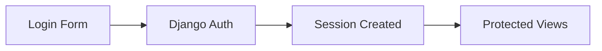

# Security Concepts

## Understanding OpenClinic Security

This document explains the security architecture and practices implemented in OpenClinic.

## Authentication

OpenClinic uses Django's authentication system with a custom Staff model:



### Login Requirements

- All views require authentication via `LoginRequiredMixin`
- Custom login URL: `/login/`
- Session management handled by Django

## Authorization

### Permission Model

| Role | Access Level |
|------|-------------|
| Staff (Superuser) | Full access to all features |
| Staff (Regular) | Limited to assigned patients |

### Object-Level Permissions

Access to patient data is controlled at the view level:

```python
class PatientDetail(LoginRequiredMixin, DetailView):
    model = Patient
    
    def get_object(self):
        return get_object_or_404(Patient, pk=self.kwargs['pk'])
```

## Data Protection

### Personally Identifiable Information (PII)

The following fields contain sensitive PII:

| Field | Protection |
|-------|------------|
| SSN (Social Security Number) | Encrypted at rest, masked in logs |
| TIN (Tax ID) | Encrypted at rest |
| Medical History | Access controlled by role |

### Logging

Sensitive data is never logged:

```python
# BAD - Logs sensitive data
logger.info(f"Patient SSN: {patient.ssn}")

# GOOD - Logs without sensitive info
logger.info(f"Patient {patient.id} accessed")
```

## Web Security

### Enabled Middleware

```python
MIDDLEWARE = [
    'django.middleware.common.CommonMiddleware',  # Security headers
    'django.contrib.csrf.CsrfViewMiddleware',     # CSRF protection
    'django.middleware.clickjacking.XFrameOptionsMiddleware',  # Clickjacking
]
```

### Security Headers

| Header | Value | Purpose |
|--------|-------|---------|
| X-Frame-Options | DENY | Prevents clickjacking |
| X-Content-Type-Options | nosniff | Prevents MIME sniffing |
| Strict-Transport-Security | (Production) | Enforces HTTPS |

## Error Handling

### Safe Error Responses

Errors never expose internal details:

```python
# Instead of exposing exceptions:
try:
    patient = Patient.objects.get(pk=pk)
except Exception as e:
    logger.error(f"Error fetching patient {pk}: {e}")
    raise Http404("Resource not found")
```

### 404 vs 500

| Scenario | Response |
|----------|----------|
| Non-existent patient | 404 Not Found |
| Server error | 500 Internal Server Error |
| Permission denied | 403 Forbidden |

## Password Security

Staff passwords are hashed using Django's default:

```python
# Default: PBKDF2 with SHA256
PASSWORD_HASHERS = [
    'django.contrib.auth.hashers.PBKDF2PasswordHasher',
]
```

For enhanced security in production, consider:

```python
PASSWORD_HASHERS = [
    'django.contrib.auth.hashers.Argon2PasswordHasher',
]
```

## Development vs Production

### Development Settings

```python
DEBUG = True
ALLOWED_HOSTS = ['localhost', '127.0.0.1']
```

### Production Requirements

```python
DEBUG = False
ALLOWED_HOSTS = ['your-domain.com']
SECURE_SSL_REDIRECT = True
SESSION_COOKIE_SECURE = True
CSRF_COOKIE_SECURE = True
```

## Audit Logging

All significant actions are logged:

| Event | Log Level |
|-------|-----------|
| Patient created | INFO |
| Patient deleted | WARNING |
| Failed login attempt | ERROR |
| Permission denied | WARNING |

See [`role_audit_report.md`](role_audit_report.md) for full security audit.
