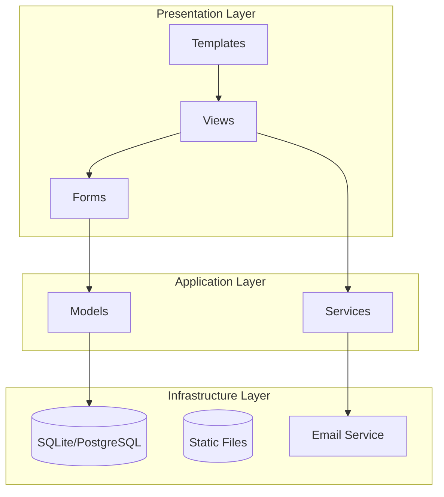
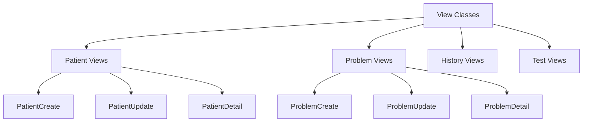
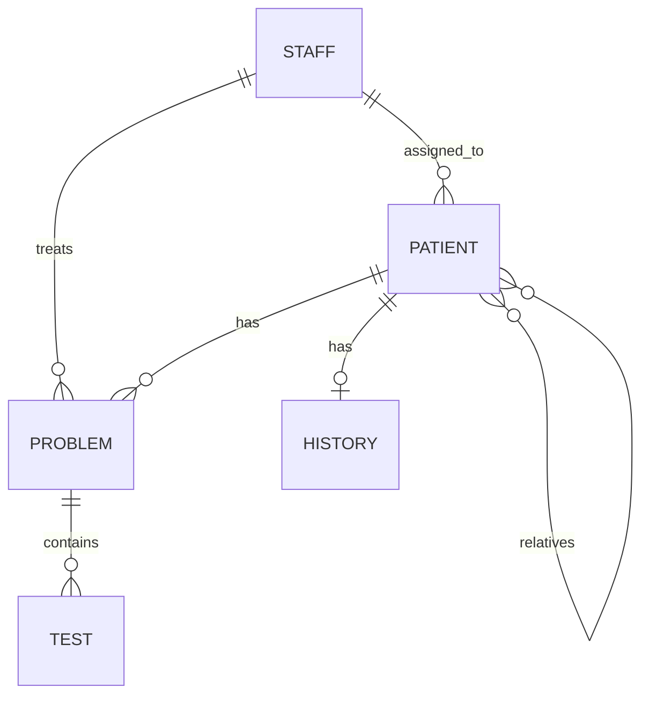
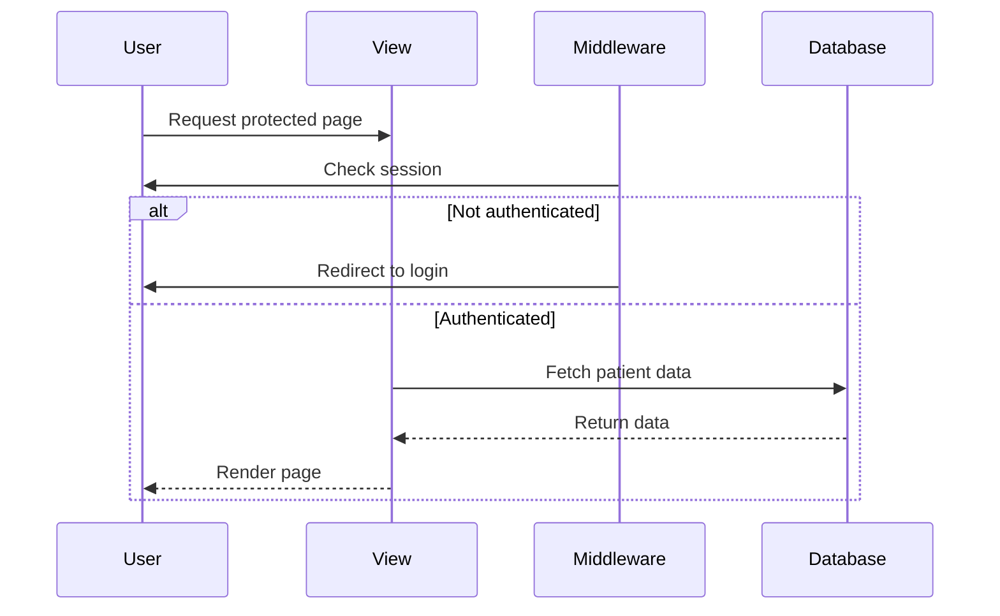

---
category: reference
audience: Developers needing technical details
---

# Architecture Reference

## System Architecture

OpenClinic follows Django's MVT (Model-View-Template) pattern with additional layers for forms and services.

## High-Level Architecture



## Application Structure

### Models Layer

Located in `medical/models/`:

| Model | Purpose | Key Fields |
|-------|---------|------------|
| **Patient** | Patient demographics | first_name, last_name, gender, birth_date |
| **Problem** | Medical problems | patient FK, wording, closing_date |
| **History** | Patient antecedents | patient FK, medical_intolerance |
| **Test** | Medical documents | problem FK, document file |
| **Staff** | User accounts | email, first_name, last_name, collegiate_number |

### Views Layer

Located in `medical/views/`:



### Custom Managers

Problem model uses custom managers:

```python
class OpenedManager(models.Manager):
    def get_queryset(self):
        return super().get_queryset().filter(closing_date__isnull=True)

class ClosedManager(models.Manager):
    def get_queryset(self):
        return super().get_queryset().filter(closing_date__isnull=False)
```

## Database Schema

### Entity Relationships



### Database Indexes

| Table | Index | Purpose |
|-------|-------|---------|
| patient | (last_name, first_name) | Name searches |
| patient | birth_date | Age queries |
| patient | tin | Tax ID lookups |
| problem | (patient_id, order_number) | Problem ordering |
| problem | closing_date | Open/closed filtering |

## Middleware Stack

```python
MIDDLEWARE = [
    'django.middleware.common.CommonMiddleware',
    'django.contrib.sessions.middleware.SessionMiddleware',
    'django.contrib.auth.middleware.AuthenticationMiddleware',
    'django.contrib.messages.middleware.MessageMiddleware',
    'django.middleware.clickjacking.XFrameOptionsMiddleware',
]
```

## Authentication Flow


