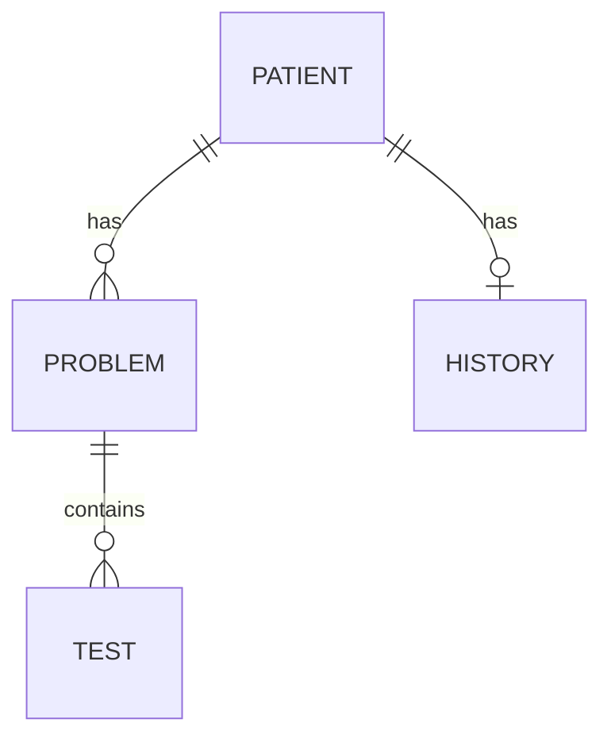

# Getting Started with OpenClinic

## Tutorial: Your First Patient Record

In this tutorial, you'll learn how to create and manage patient records in OpenClinic.

## Prerequisites

- Python 3.10 or higher
- Django 5.2+
- Git for version control

## What You'll Learn

- Navigating the OpenClinic interface
- Creating your first patient record
- Adding medical problems
- Viewing patient history

---

## Step 1: Create a Superuser

First, create an admin account to access the system:

```bash
cd openclinic-in-django
python manage.py createsuperuser
```

Follow the prompts to set up your credentials.

## Step 2: Start the Development Server

```bash
python manage.py runserver
```

Navigate to `http://localhost:8000/` and log in with your superuser account.

## Step 3: Add Your First Patient

1. Click **Patients** in the main navigation
2. Click **Add New Patient**
3. Fill in the required fields:
   - First Name
   - Last Name
   - Gender (optional)
   - Birth Date


## Step 4: Add a Medical Problem

1. Open the patient record you just created
2. Click **Add Medical Problem**
3. Fill in the problem details:
   - Wording (problem description)
   - Subjetive (patient symptoms)
   - Objetive (clinical findings)

## Step 5: View Patient History

Navigate to the patient's detail page to see:

- Active medical problems
- Closed problems (history)
- Medical tests and documents
- Antecedents (personal and family)



## Summary

You've now completed your first patient workflow in OpenClinic! 

**Next steps:**
- Explore [Patient Management](patient-management.md) for advanced features
- Set up [development environment](how-to/development.md)
- Review [security concepts](explanation/security.md)

## Troubleshooting

| Issue | Solution |
|-------|----------|
| "Permission denied" | Ensure you're logged in as a superuser |
| Form won't save | Check required fields are filled |
| Page won't load | Verify database migrations: `python manage.py migrate` |
