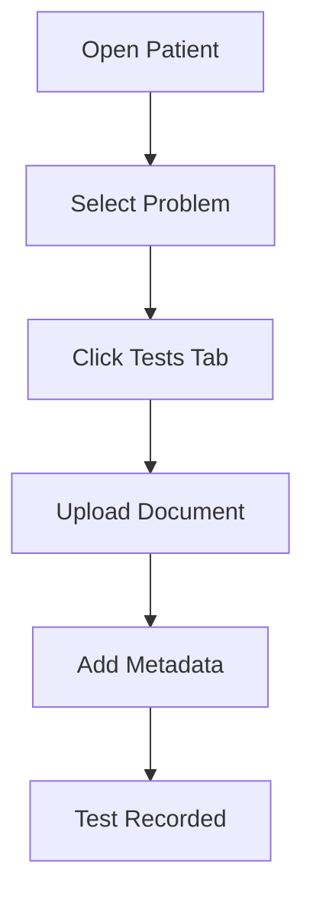

# Patient Management Tutorial

## Advanced Patient Operations

This tutorial covers advanced patient management features in OpenClinic.

## What You'll Learn

- Managing patient relationships (relatives)
- Tracking medical history
- Handling medical tests and documents
- Generating medical reports

---

## Step 1: Managing Patient Relatives

OpenClinic supports linking patients to their relatives:

1. Open a patient record
2. Navigate to **Relatives** tab
3. Search for existing patients to link

```python
# Patient relatives are stored as ManyToMany relationship
class Patient(TimeStampedModel):
    relatives = models.ManyToManyField('self', blank=True)
```

## Step 2: Recording Medical History

### Personal Antecedents

Record patient's personal medical history:

- Medical intolerances
- Birth and growth information
- Habits and lifestyle
- Previous surgeries

### Family Antecedents

Track family medical history:

- Parents' health status
- Siblings' health status
- Hereditary conditions

## Step 3: Managing Medical Tests

Upload and manage medical documents:



## Step 4: Generating Medical Reports

OpenClinic generates comprehensive medical reports:

1. Navigate to patient detail
2. Click **Medical Report**
3. Report includes:
   - Patient demographics
   - Active problems
   - Medical history
   - Recent tests

## Summary

You've completed the patient management tutorial!

**Related documentation:**
- [Installation Guide](../how-to/install.md)
- [Security Concepts](../explanation/security.md)
- [Architecture Reference](../reference/architecture.md)
